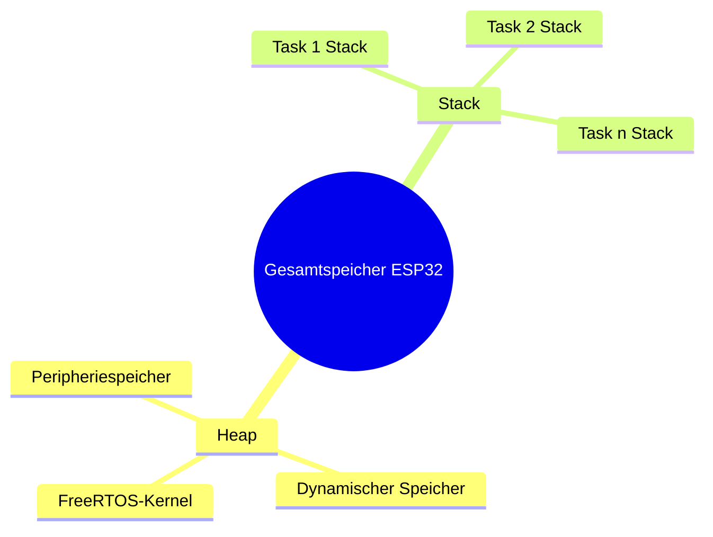

```mermaid
mindmap
  root((Gesamtspeicher ESP32))
    Heap
      FreeRTOS-Kernel
      Dynamischer Speicher
      Peripheriespeicher
    Stack
      Task 1 Stack
      Task 2 Stack
      Task n Stack
```
