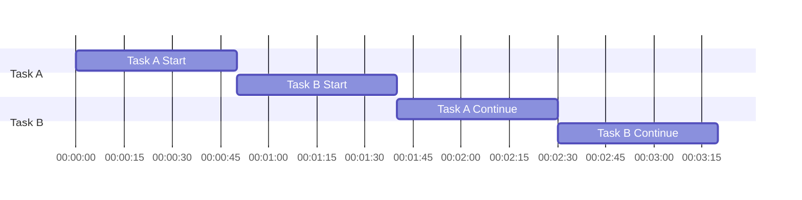

```mermaid
gantt
    dateFormat  HH:mm:ss
    axisFormat  %H:%M:%S
    section Task A
    Task A Start       :a0, 00:00:00, 00:00:50
    section Task B
    Task B Start       :b0, 00:00:50, 00:01:40
    section Task A
    Task A Continue    :a1, 00:01:40, 00:02:30
    section Task B
    Task B Continue    :b1, 00:02:30, 00:03:20
```
