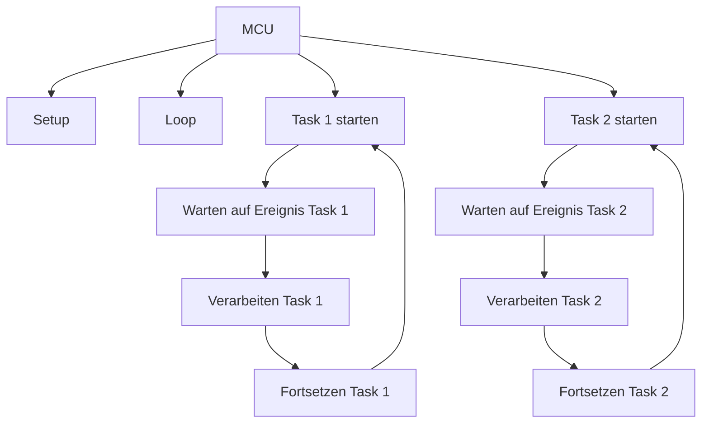

```mermaid
graph TD
    A[MCU] --> R[Setup]
    A --> O[Loop]
    B[Task 1 starten]
    A --> B[Task 1 starten] 
    A --> C[Task 2 starten]
    B --> D[Warten auf Ereignis Task 1]
    C --> E[Warten auf Ereignis Task 2]
    D --> F[Verarbeiten Task 1]
    E --> G[Verarbeiten Task 2]
    F --> H[Fortsetzen Task 1]
    G --> I[Fortsetzen Task 2]
    H --> B
    I --> C
```
