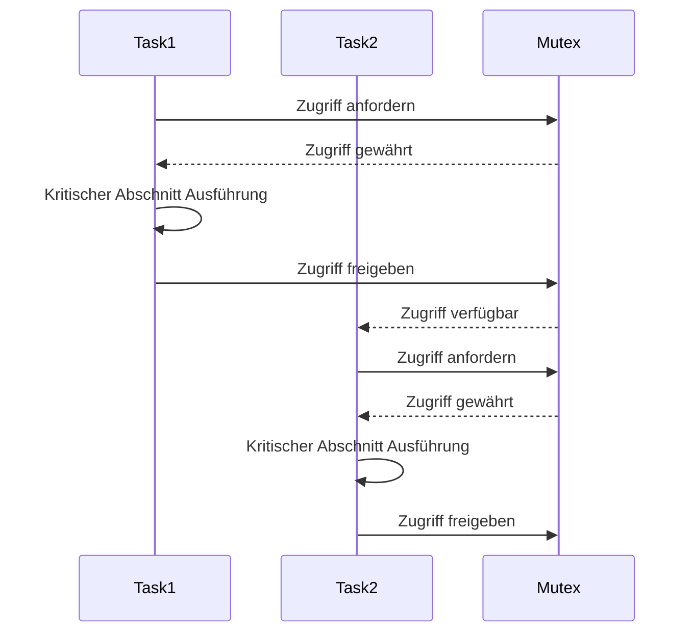

```mermaid
sequenceDiagram
    participant Task1
    participant Task2
    participant Mutex

    Task1->>Mutex: Zugriff anfordern
    Mutex-->>Task1: Zugriff gewährt
    Task1->>Task1: Kritischer Abschnitt Ausführung
    Task1->>Mutex: Zugriff freigeben
    Mutex-->>Task2: Zugriff verfügbar

    Task2->>Mutex: Zugriff anfordern
    Mutex-->>Task2: Zugriff gewährt
    Task2->>Task2: Kritischer Abschnitt Ausführung
    Task2->>Mutex: Zugriff freigeben
```
