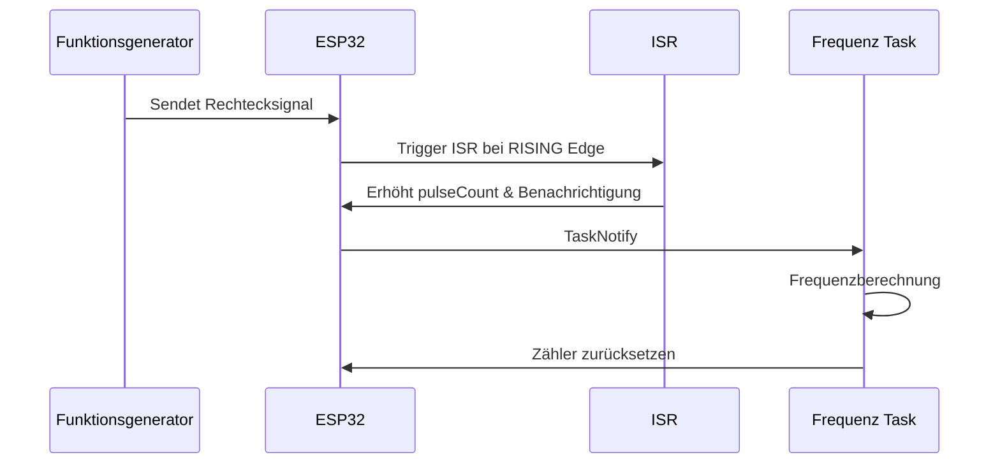

```mermaid
sequenceDiagram
  participant F as Funktionsgenerator
  participant E as ESP32
  participant ISR as ISR
  participant Task as Frequenz Task

  F->>E: Sendet Rechtecksignal
  E->>ISR: Trigger ISR bei RISING Edge
  ISR->>E: Erhöht pulseCount & Benachrichtigung
  E->>Task: TaskNotify
  Task->>Task: Frequenzberechnung
  Task->>E: Zähler zurücksetzen

```
