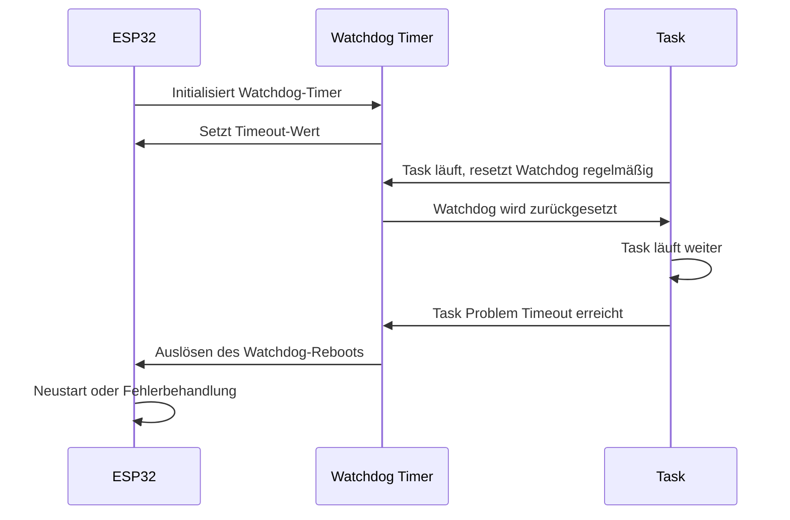

```mermaid
sequenceDiagram
  participant System as ESP32
  participant WDT as Watchdog Timer
  participant Task as Task

  System->>WDT: Initialisiert Watchdog-Timer
  WDT->>System: Setzt Timeout-Wert
  Task->>WDT: Task läuft, resetzt Watchdog regelmäßig
  WDT->>Task: Watchdog wird zurückgesetzt
  Task->>Task: Task läuft weiter
  Task->>WDT: Task Problem Timeout erreicht
  WDT->>System: Auslösen des Watchdog-Reboots 
  System->>System: Neustart oder Fehlerbehandlung
```
